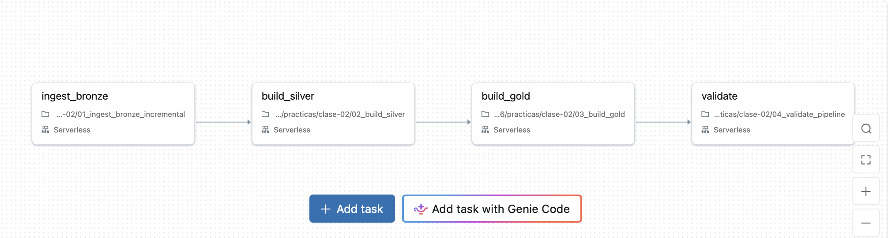

# Resolución — Práctica 2: Silver, Gold y orquestación

## Datos del alumno

- Nombre: Ricardo Aníbal Cheluja
- student_id: drrach
- Escala: small
- Catálogo y esquema: workspace.bigdata_drrach

## Job y dependencias

- Nombre exacto del Job: bigdata_2<student_id>_silver_gold
- URL del Job: [•	https://dbc-4b1b6668-73d5.cloud.databricks.com/jobs/302407002750599?o=7474651579613320]

Las tareas se ejecutan en este orden:

ingest_bronze → build_silver → build_gold → validate

Cada tarea posterior se ejecuta únicamente si su dependencia
terminó correctamente.

### DAG del Job



## Primera y segunda ejecución

La segunda ejecución se realizó sin volver a ejecutar el generador,
manteniendo los mismos parámetros y archivos de entrada.

| Métrica | Primera ejecución | Segunda ejecución |
|---|---:|---:|
| Cantidad de transacciones en Silver | [valor] | [valor] |
| Cantidad de registros en cuarentena | [valor] | [valor] |
| [Métrica Gold informada por validate] | [valor] | [valor] |
| [Otra métrica informada por validate] | [valor] | [valor] |
| idempotence_compared | [resultado] | True |
| Estado de validate | Succeeded | Succeeded |

Las métricas de negocio permanecieron iguales.
La auditoría incorporó una fila por ejecución.


## Reconciliación de batch_002

| Concepto | Cantidad |
|---|---:|
| Filas físicas recibidas en Bronze | [valor] |
| Aceptadas según el resumen del lote | [valor] |
| Rechazadas según el resumen del lote | [valor] |
| Transacciones vigentes en Silver del lote | [valor] |

Consultas utilizadas:

```sql
SELECT *
FROM workspace.bigdata_drrach.gold_batch_summary
WHERE source_batch_id = 'batch_002';
```

[Agregar las consultas utilizadas para completar y reconciliar
las cantidades.]

## Por qué COPY INTO y MERGE resuelven problemas diferentes

COPY INTO controla la incorporación de archivos a Bronze y evita
volver a cargar un archivo ya procesado en condiciones normales.
Su unidad de control es el archivo.

MERGE compara los registros de entrada con los existentes mediante
la clave y las condiciones definidas en el pipeline. Permite insertar
transacciones nuevas y actualizar las existentes con correcciones.

Por eso, evitar repetir archivos no alcanza para resolver duplicados
o correcciones que llegan dentro de archivos nuevos. Para mantener
una sola versión por transaction_id también se necesita deduplicar
la entrada y aplicar correctamente el MERGE.

## Visualizaciones y respuestas

### Pregunta 1

**Enunciado:** [copiar pregunta]


**Respuesta:** [conclusión explícita, con categoría y valores]

**Consulta utilizada:**

```sql
-- Pegar consulta real.
```

### Pregunta 2

**Enunciado:** [copiar pregunta]


**Respuesta:** [conclusión explícita basada en los resultados]

**Consulta utilizada:**

```sql
-- Pegar consulta real.
```

### Pregunta 3

**Enunciado:** [copiar pregunta]


**Respuesta:** [conclusión explícita basada en los resultados]

**Consulta utilizada:**

```sql
-- Pegar consulta real.
```

### Pregunta 4

**Enunciado:** [copiar pregunta]


**Respuesta:** [conclusión explícita basada en los resultados]

**Consulta utilizada:**

```sql
-- Pegar consulta real.
```

## Las 20 preguntas de análisis y comprensión

### Pregunta 1

**Enunciado:** [copiar enunciado]

**Respuesta:** [respuesta y resultados cuando corresponda]

**Consulta utilizada, si corresponde:**

```sql
-- Pegar consulta real.
```

[Repetir esta estructura para las preguntas 2 a 20.]
